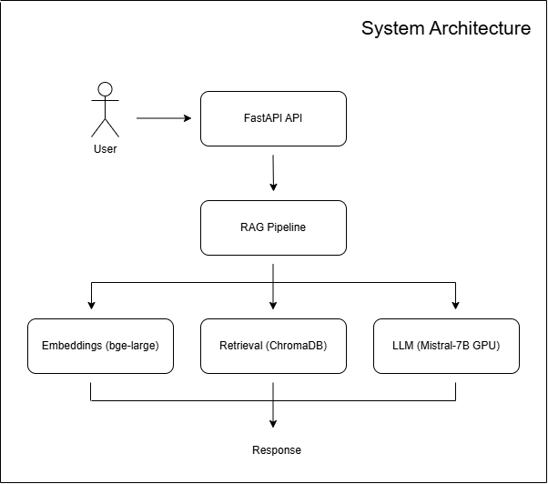
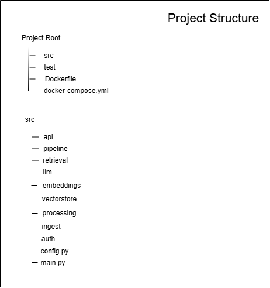

# Medical RAG Production System (Self-Hosted AI Platform)

## Project Overview

This project is a fully self-hosted Retrieval-Augmented Generation (RAG) system designed and deployed from scratch.
It combines local LLM inference, persistent vector search, and a production-grade API layer to deliver real-time AI responses.
The system was built with a strong focus on infrastructure ownership, reliability, and deployment realism, avoiding dependency on managed AI platforms.

## Key Features

- End-to-end RAG pipeline built from scratch
- Local LLM inference (Mistral-7B-Instruct)
- Embedding-based retrieval system (bge-large-en-v1.5)
- Persistent vector database using ChromaDB
- FastAPI-based production API
- GPU-accelerated inference
- Fully containerized deployment (Docker)
- Deterministic and stable runtime behavior
- AWS EC2 GPU production deployment

## Architecture

The system is designed as a modular Retrieval-Augmented Generation (RAG) pipeline:

- API Layer: FastAPI service exposing inference endpoints  
- Authentication Layer: request-level authentication and access control  
- Pipeline Layer: orchestration of the full RAG workflow  
- Retrieval Layer: semantic search over a persistent vector database (ChromaDB)  
- Embedding Layer: text embedding generation using bge-large-en-v1.5  
- LLM Layer: local GPU-based inference using Mistral-7B-Instruct  
- Storage Layer: persistent vector store enabling fast similarity search  
- Processing Layer: text chunking and document preprocessing  
- Ingestion Layer: PDF loading and document parsing  
- Configuration Layer: centralized system configuration management  
- Entry Point: application bootstrap (main.py)

## System Initialization

On first execution, the system is capable of performing full environment setup, including:

- Loading and initializing local models (LLMs and embedding models)
- Processing raw PDF documents
- Text chunking and preprocessing
- Generating embeddings
- Building the vector database (ChromaDB)

For production deployment, this process is bypassed as a pre-built persistent vector database is already available, ensuring fast and deterministic startup behavior.

## Tech Stack

- Python
- FastAPI
- Docker
- ChromaDB
- Mistral-7B-Instruct
- bge-large-en-v1.5 embeddings
- AWS EC2 GPU
- NVIDIA CUDA runtime

## Deployment

The system is currently deployed in production on AWS EC2 GPU infrastructure using Dockerized services.
It exposes a stable REST API for real-time inference and retrieval operations.

## Key Design Decisions

- No runtime document ingestion (precomputed vector database bae on 3314 medical pdf sheets)
- Fully self-hosted inference (no managed AI APIs)
- Persistent vector storage for deterministic retrieval
- GPU-optimized inference pipeline
- Containerized architecture for reproducibility

## Status

Production system available for live demonstration during interviews.

## Repository Note

Source code is private due to infrastructure and deployment constraints.
Full technical walkthrough and live demo are available upon request.

## Author

Leonardo Darrain Rocha  
Senior Software Engineer  
https://www.linkedin.com/in/leonardo-darrain-rocha-a6062354/  
